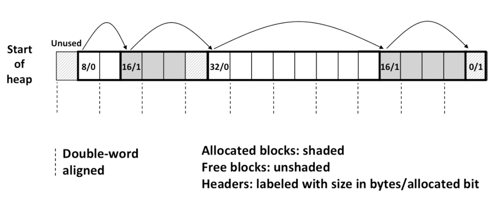
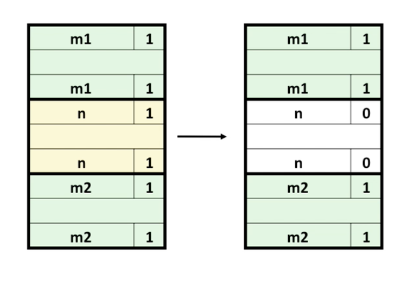
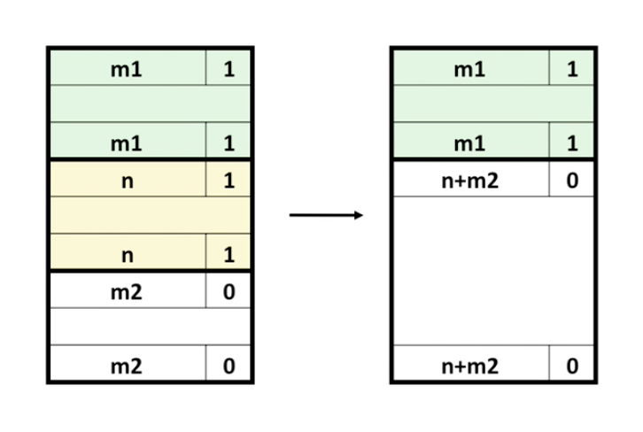
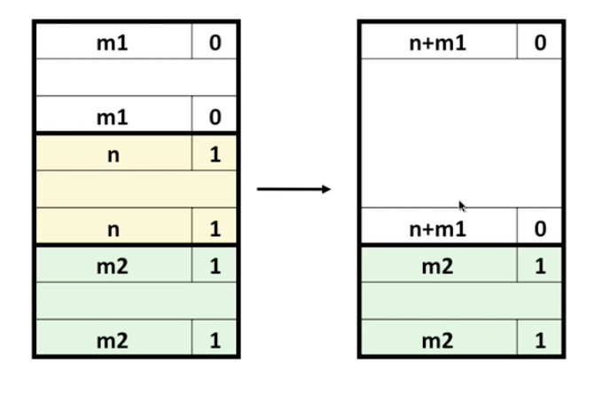
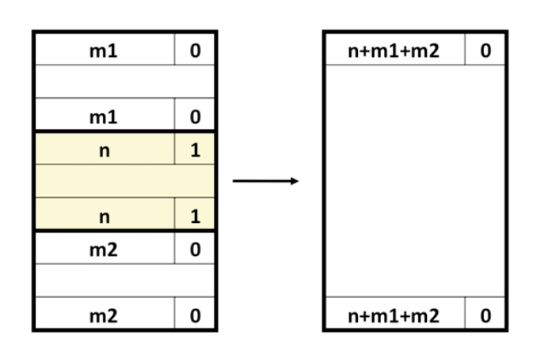
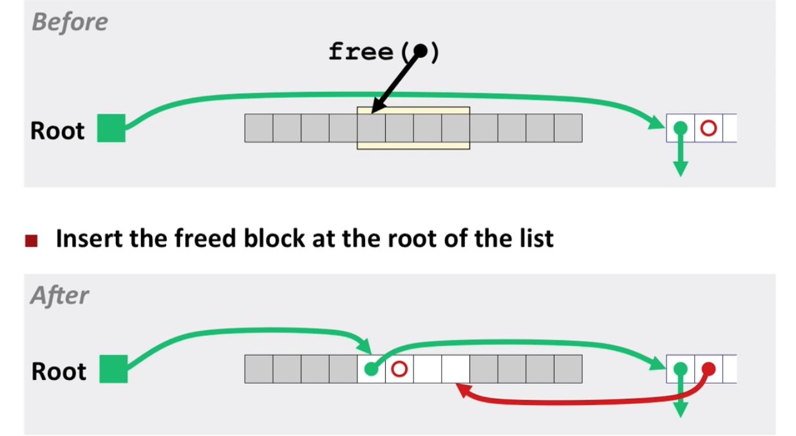
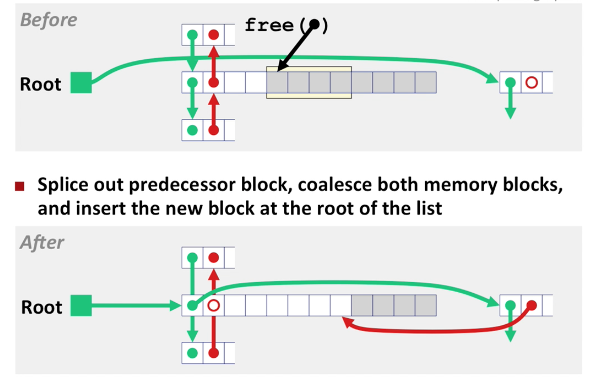
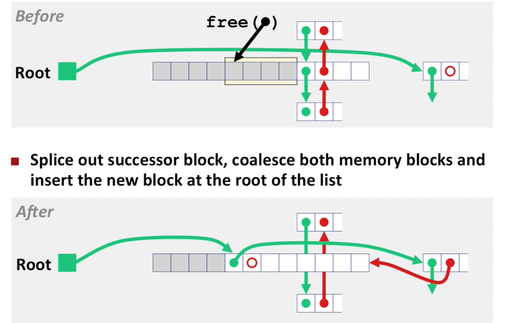

#Dynamic Memory Allocators

**Fragmentation**

1. Internal Fragmentation 
   - payload smaller than block size
   - depends on <u>previous</u> requests 
2. External Fragmentation
   - Occurs when there is enough aggregate heap memory, but no single free block is large enough
   - Depends on <u>future</u> requests


**Implementation issues:**

- How do we know how much memory to free given just a pointer?
- How do we keep track of the free blocks?
- What do we do with the extra space when allocating a structure that is smaller than the free block it is placed in?
- How do we pick a block to use for allocation — many might fit?
- How do we reinsert freed block?


**Knowing how much to free**

- Keep length of a block in the word preceding the block. (Called the *header field*)

**Keeping track of free blocks**

Four Methods:

1. *Implicit List*: Each block has a header with the block size, so you can traverse the heap by looking at every block. Con is that inorder to look at the free blocks, you have to look at every block.
2. *Explicit List*: Still use headers but use some of the data in the free blocks to point to the next free block so you can skip the allocated blocks.
3. *Segregated Free List*: Different free lists for different size classes.
4. *Blocks Sorted by Size*: Can use a balanced tree (e.g. Red-Black tree) with pointers within each free block, and the length used as a key.

##Implicit List Implementation:

For each block we need both size and allocation status (using two words would be wasteful).



**Implicit List: Finding a free block:**

```c
// First Fit: choose first free block that fits
p = start;
while ((p < end) &&    // not passed end
       ((*p & 1) ||    // already allocated
        (*p <= len)))  // too smalle
    p = p + (*p & -2); // goto next block (word addressed)
```

Best Fit: Search the list, choose the best free block: fits, with fewest bytes left over.

Keeps fragments small — usually improves memory utilization

Will typically run slower than first fit

```c
// Best Fit
...
```

**Implicit List: Allocating a Free Block**

- Could allocate whole block
- OR allocated only whats needed and spit out a free block

```c
void add_block(ptr p, int len) {
    int newsize = ((len + 1) >> 1) << 1; // round up to even
    int oldsize = *p & -2; 				 // mask out low bit
    *p = newsize | 1;                    // set new length
    if (newsize < oldsize)
        *(p + newsize) = oldsize - newsize;  // set length in remaining 
     										 // part of block
}
```

**Implicit List: Freeing a block**

Simple implementation just clears allocated bit:

```c
void free_block(prt p) { *p = *p & -2; } // clear allocated bit
```

However, can lead to false fragmentation (contiguous free blocks).

So we need to *coalesce* (join) with next/previous blocks if they are free.

Easy to do with next block:

```c
void free_block(ptr p) {
    *p = *p & -2;	// clear allocated flag
    next = p + *p;  // find next block
    if ((*next & 1) == 0)
        *p = *p + *next;	// add to this block if not allocated
    
}
```

*But how do we do it with previous block?*

You basically create a doubly linked list by replicating the header of each block at the end of each block as a *footer* also called *boundry tag*. This way whenever you are freeing a block, you can just look one word back and see if the block before it is free or allocated.

Four Cases:

1. Previous and next block are allocated:



2. Previous block is allocated and next block is free:



3. Previous block is free and next block is allocated:



4. Previous and next blocks are free:



Which blocks need a boundry tag?

NOTE: ALLOCATED BLOCKS DO NOT NEED BOUNDRY TAGS BECAUSE WE DON'T COALESCE THEM

However, we still need a way to check if a previous block is allocated or not when coalescing.

Solution: use second bit in the header of a free block to denote whether or not the previous block is free. If it is free, then the previous block will have a footer with the size of the previous block. Otherwise we don't care.

**Key Policies when Implementing and Allocator:**

1. Placement Policy: (trades off lower throughput for less fragmentation)
   - first-fit
   - next-fit: don't do this it's been shown to be bad on empiracle studies.
   - best-fit
   - good-fit: only search portion of heap and determine bestfit within that region.
   - multiple free lists: improves memory utilization and performance.
2. Splitting Policy: what do we do with the leftovers? Upto a certain size you may not want to split -> don't create free blocks smaller than some threshold.
3. Coalescing Policy: freeing is constant time because of the boundry tag footers but you can speed it up even more by defering the coalescing. i.e. instead of coalescing every time the free is called, defer it until you scan the free list trying to place an allocated block in response to a malloc call (he doesn't say which is better just that it's an option.

**Implicit List Summary**

Allocate cost: linear time worst cast

Free cost: constant time worst case even with coalescing

Memory usage: will depend on placement policy

Note: implicit lists are not used in pracitce because of linear time allocation

#Lecture 20

**Peak Memory Utilization**

Executing sequence of requests: $R_0,R_1,R_2,...,R_k,...R_{n+1}$

$H_k​$ is the heap size after $k+1​$ requests.

$P_k$ is the sum of all the payloads after $k+1$ requests.

$P_k$ is the minimum number of bytes required by the allocated blocks. It's impossible to achieve but we use it as a best case.

Peak memory utilization after $k+1$ requests:

$$u_k=\frac{max_{i\leq k}P_i}{H_k}$$

This higher the better. The numerator is constant. What varies is $H_k$ depends on how efficient your allocator is using the heap storage.

## Explicit Free List

Each free block contains pointers to next and previous free blocks.

**Allocaction**

For allocation you just update 6 pointers. The prev, next pointers of the previous free block, the allocated block and the next free block.

**Freeing with Explicit Free Lists**

Where do you put the freed element? LIFO or Address-ordered:

1. LIFO (last-in-first-out) 

   Insert freed block at the beginning of the freed list

   - Pro: simple and constant time
   - Con: fragmentation is worse than address-ordered

2. Address-ordered

   insert freed blocks so that free list blocks are always addres ordered:

   > address(prev) < address(current) < address(next)

   - Pro: less fragmentation than LIFO
   - Con: requires search

> NOTE: Somebody always tries to implement malloc with some kind of balanced tree which seems like a good idea but you have to realize you are competeing with other techniques like segregated lists which are very fast and have very small constant factors. Constant factors of balanced trees can be quite large. With segregated list as the number of size classes you have approaches infinity, your search time approaches constant time. If you have size classes that cover powers of two then search time approaches log time anyway. I would suggest just doing the simple thing and optimizing only when you see that you need to optimize. 

Reexamine four cases of freeing but with explicit list and the LIFO policy:

> NOTE: There are two notions of previous and next. Given some block in the free list there are the predecessory  and successor blocks *in memory* which may or may not be in the free list. There are also the previous and next blocks which are adjacent in the free list.
>
> The notation that will be used is as follows:
>
> - Predecessor, Successor = adjaccent blocks in memory
> - previous, next = adjecent blocks in the free list

Case 1: predecessor and successor blocks are allocated



- update root of free list to point to newly freed block
- update forward pointer of block to point to what used to be the first block

Case 2: predecessor block is free, successor block is allocated



- coalesce the freed block with the predecessor block
- splice by updating the next pointer of its previous block point to its next block and by updating the previous pointer of its next block to point to its previous block
- have the root of the free list point to the newly freed coalesced block
- update the newly freed coalesced blocks next pointer to point to what used to be the first block
- update what used to be the first block's previous pointer to point back to the newly freed coalesced block

> NOTE: optimization of case two: after you coalesce just leave block there instead of moving it to the front of the free list.

Case 3: predecessor block is allocated, sucessor block is free.



- coalesce newly freed block with sucessor block
- splice out block and insert at previous list similar to case two (completely symmetric).

> NOTE: can't optimize this case like case two. whether you put it in the beginning of the list or leave it there you still have to update the same number of pointers.

Case 4: both predecessor and successor blocks are free

- coalesce newly freed block with both sucessor and predecessor

> SUGGESTION: The code for the above cases is some of the most difficult code to write. Start with the implicit list allocator and write two functions *insert_block* and *remove_block* that insert and remove blocks from the free list. That will bring you from an F allocator to a B- allocator. To get an A allocator you need to use segregated lists.

**Explicit List Summary**

- Allocation: linear time in number of <u>*free*</u> blocks instead of <u>*all*</u> blocks.

- Slightly more complicated allocate and free since needs to splice blocks in and out of the list

- Some extra space for the links (2 extra words needed for each block) which increases minimum block size.

  ​

  In practice still not efficient enough for an allocator but are useful as part of a segregated list allocator when you use multiple explicit lists.


> NOTE: struct of previous and next nodes for linked list

##Segregated List Allocators

Each size class of blocks has its own free list.

Often have separate classes for each small size.

For larger sizes: one class for each range of power of two size.

To allocate a block of size n:

1. Search appropriate free list for block of size $m > n$
2. If appropriate block is found 
   1. Split block and place fragment on appropriate list (optional)
3. If no block is found, try next larger class
4. Repeat until block found
5. If no block found
   1. request additional memory from heap
   2. allocate block of n bytes from this new memory
   3. place remainder as single free block in largest class

Seglist allocators approximate best fit without sacrificing perfo

## Pointers

**Casting Pointers**

1. pointer to pointer
   - gives back the same value (unlike casting values)
   - changes the behavior that will happen when you dereference it or do arithmetic on it
2. pointer to int
   - pointers are really just 8-byte numbers
   - behaves like casting long long -> int

**Pointer Arithmetic**

The expression `ptr + a` doesn't mean the same thing as if `ptr` was an integer.

If you increment a pointer, it actually increments it by the size of the object it points to.

```c
type_a *pointer = ...;
(void *) pointer2 = (void *) (pointer + a);

// this is really computing:
pointer2 = pointer + (a * sizeof(type_a));
```

NOTE: Pointer arithmetic on `(void *)` is undefined. gcc might not complain but in K&R it is undefined.

Examples:

```c
/* 64-bit machine */

// ex1
int *ptr = (int *) 0x12341230;
int *ptr2 = ptr + 1;				// results in ptr2 = 0x12341234

// ex2
char *ptr = (char *) 0x12341230;
char *ptr2 = ptr + 1;				// results in ptr2 = 0x12341231

// ex3
int *ptr = (int *) 0x12341230;
int *ptr2 = ((int *) (((char *) ptr) + 1));	// results in ptr2 = 0x12341231

// ex4
// arithmetic on a void pointer is undefined but we don't cast to (void *) untill
// after we have computed the value and casting doesn't change the value
char *ptr = (char *) 0x12341230;
void *ptr2 = ptr1 + 1;				// results in ptr2 = 0x12341231

// ex5
char *ptr = (int *) 0x12341230;
void *ptr2 = ptr1 + 1;				// results in ptr2 = 0x12341231
```

More Examples:

```c
// ex1
// because ptr is a pointer to a pointer to an int
// addition is defined as adding the size of an (int *) which is 8
int **ptr = (int **) 0x12341230;
int *ptr2 = (int *) (ptr + 1);		// ptr2 = 0x12341238

// ex2
// all pointers are size 8 so the same thing happens. char/short don't matter
char **ptr = (char **) 0x12341230;
short *ptr2 = (short *) (ptr + 1);	// ptr2 = 0x12341238

// ex3
// the address of a pointer is not the same as the pointer itself
int *ptr = (int *) 0x12341230;
void *ptr2 = &ptr + 1;				// ptr2 = 8 byte higher than the address of the variable ptr, which is somewhere on the stack

// ex4
int *ptr = (int *) 0x12341230;
void *ptr2 = ((void *) (*ptr + 1)); // ptr2 = ??
// ptr2 is one plus the value at 0x12341230 (which is just some random location) undefined but probably segfaults
```

**Dereferencing**

- Cannot dereference something of type `void *`
- Dereferencing `t*` gives back a value of type `t`

```c
int *ptr1 = malloc(sizeof(int));
*ptr1 = 0xdeadbeef;

int val1 = *ptr1;					// val1 is 0xdeadbeef
int val2 = (int) *((char *) ptr1);	
// casting to a character pointer and dereferencing gives us 1 byte at that address
// *((char) ptr1) will return "ef" because of little endian
// val2 is ffffffef because you the most significant bit is 1 so when you sign extend you add f's
```

**Heap Checker** 

should make sure that

- check that all the invariants of your design hold


- there are never contiguous free blocks

- every free block should be in a free list somewhere (scan heap counting number of free blocks, scan free list make sure count matches)

- Consider using a MACRO to turn the heap checker on and off

  - this way you don't have to edit all the places you call it

  - ```c
    // to turn it on:
    #define checkheap(lineno) mm_checkheap(lineno)

    // to turn it off redefine it to nothing
    #define checkheap(lineno)
    ```

  - create a macro `checkheap(lineno)` that calls the heapchecker `mm_checkheap(lineno)`

- There is a built-in macro called `__LINE__` that gets replaced with the line number it's on

  - you can use this to make the heap checker tell you where it failed

  - ```c
    // example:
    mm_checkheap(__LINE__);
    ```

- ```c
  #ifdef DEBUG
  # define CHECKHEAP(lineno) printf("%s\n", __func__); mm_checkheap(__LINE__);
  #endif
  ```

- needs to accept exactly the valid heaps and reject everything else

**Heap Checker Invariants**

- Block Level:
  - Header and footer match
  - payload area is aligned
- List Level:
  - Nex/prev pointers in consecutive free blocks are consistent
  - free list contains no allocatated blocks
  - all free blocks are in the free list (lif you loop through the heap and the free list you should get the same number of free blocks)
  - no cycles in the list (unless you use circular lists)
  - segregated list contains only blocks that belong to the size class
- Heap level:
  - prologue/epilogue blocks are at specific locations (e.g. heap boundries) and have special size/alloc fields
  - all blocks stay in between the heap boundaries
  - no contiguous free blocks in memory (unless you defer coalescing)
- your own invarients (e.g. address order or size order)
- ...

**Hare and Tortoise Algorithm (Cycles)**

- detects cycles in linked lists in linear time
- two pointers one is the hare one is the tortoise at the beginning of the linked list
- during each iteration, the hare moves forward by two, the tortoise moves forward by one
  - if the hare reaches the end of the list, there are no cycles
  - if they are pointing at the same node, there is a cycle
- explanation: once the tortoise reaches the beginning of a cycle, we know the hare is somewhere in the cycle. at every step the hare moves by two and the tortoise moves by one. i.e. at each step the hare become one step closer to the tortoise. so the hare <u>always</u> catches the tortoise on the tortoise's <u>first</u> time through the cycle.

**Other Things to watch for**

1. initializing everything correctly.
2. make sure you reinitizlie global values <u>every</u> time it runs
3. consider edges cases when block is at start/end of list (beginning and end of freelist and heap)
4. make sure to write you invariants in the requires section of each doc string

**Optimization**

1. number of size classes 
2. the separation of size classes
3. the amount by which the heap is extended (CHUNKSIZE)

**Valgrind**

```bash
valgrind ./mdriver -f traces/sometrace.rep -v
```


**Profiling**

In the make file update the flags from `-g` to `-pg` to generate profiling information.

Then run 

```bash
gprof ./mdriver | less
```

to view profiling information.

**Book**

| Section            | Content                   |
| ------------------ | ------------------------- |
| 9.1, 9.2, 9.3, 9.6 | Virtual Memory            |
| 9.8.4              | Lab mmap()                |
| 9.9, 9.10          | Dynamic Memory Allocation |
| All Ch. 9          | Final Exam                |

**Malloc Tips**

1. Try code as a macro and an inline function and see which gives better throughput
2. calloc and realloc are just small wrappers around malloc
3. garbled bytes error - means you have corrupted the payload
4. out of memory error - means you have allocated way more heapspace than you should have
5. segfault - do `gdb mdriver` and `run` to find out which line segfaults
   - can say `print var_name` to print variable in *gbd*