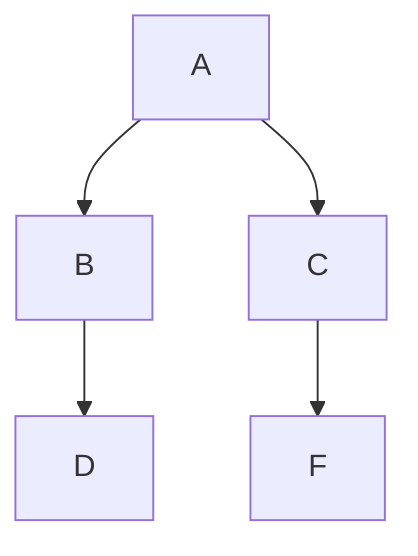

# c

**Debugging**

use *-g* when compiling for gdb debugger

```bash
clang -g -Wall -Wextra -Werror foo.c -o foo
gdb foo
```

most common gdb commands:

- `break (b) *function*` -- sets a breakpoint at the beginning of the named function.
- `run (r) *args*` -- starts running your program from the beginning, with the given command-line arguments, if any.
- `continue (c)` -- continues running the program after it has stopped at a breakpoint.
- `next (n)` -- executes the next program line, stepping over any function call. I.e., any function call is treated as a single step.
- `step (s)` -- executes the next program line, stepping into any function call. I.e., any function call is treated as many steps.
- `print (p) *expr*` -- displays the value of the expression, which probably involves some of your program's variables.
- `backtrace (bt)` -- displays the current call stack (backtrace), so that you know where the program is currently executing and how it reached that location.
- `help` -- displays some help.
- `quit` -- exits GDB.


pg 7 -> infinite loop "first time through"x1, "" x infinity


```bash
clang -Wall -Wextra -Werror program.c -o program

create non optimized assembly
gcc -Og -S file.c

gcc -O -c main.c
readelf -s main.o
```


gdb -tui for ui version of gdb




```flow
st=>start: Start|past:>http://www.google.com[blank]
e=>end: End|future:>http://www.google.com
op1=>operation: My Operation|past
op2=>operation: Stuff|current
sub1=>subroutine: My Subroutine|invalid
cond=>condition: Yes
or No?|approved:>http://www.google.com
c2=>condition: Good idea|rejected
io=>inputoutput: catch something...|future

st->op1(right)->cond
cond(yes, right)->c2
cond(no)->sub1(left)->op1
c2(yes)->io->e
c2(no)->op2->e
```

